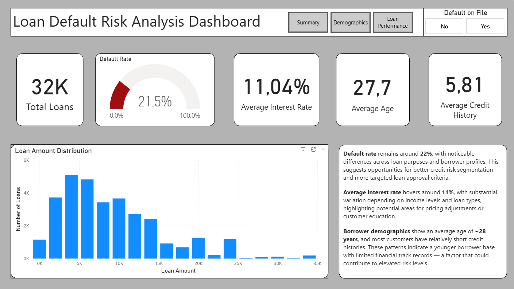
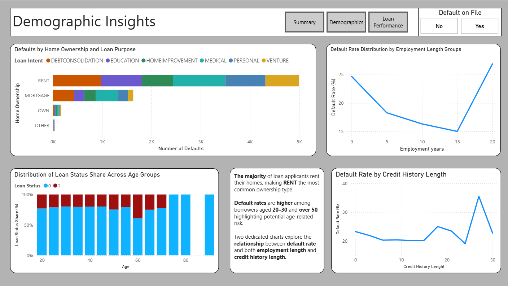
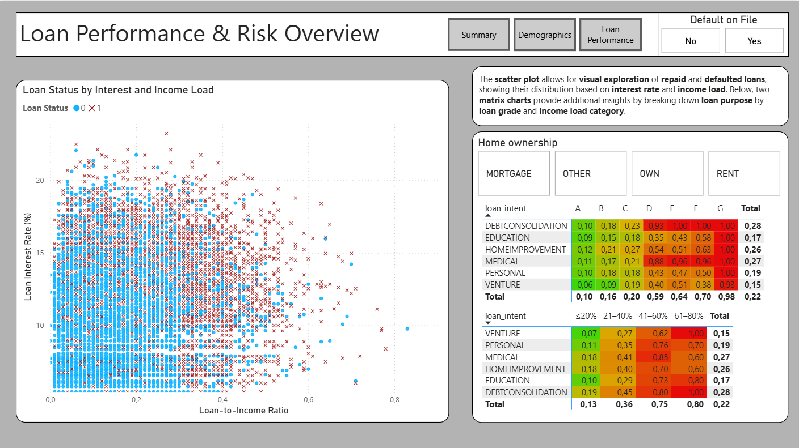

# 💳 Loan Default Analysis Dashboard

This interactive Power BI dashboard explores **loan default behavior** across ~32,000 loan applications. The goal is to help financial institutions **better understand which customer segments are most at risk of default** — and why.

## 📈 Business Context

Loan default is one of the most critical risks in the lending industry. Understanding **who defaults** and **under what circumstances** allows risk teams to adjust credit policies, fine-tune interest rates, and identify high-risk borrower profiles.

This dashboard aims to answer the key question:  
👉 **"What drives customer defaults — and how can we identify these patterns early?"**

---

## 💡 Key Insights

- **Young (20–30) and older (50+) borrowers** show **higher default rates**, suggesting age-related financial instability.
- Applicants with **short credit histories** and **shorter employment length** are more likely to default.
- The **RENT** group dominates the applicant pool and exhibits **elevated default rates**.
- Certain **loan intents**, such as debt consolidation or medical loans, have **higher default probability**, especially in lower loan grades.

---

## 📊 Dashboard Features

- 📌 **KPI Cards**: Total Loans, Avg. Interest Rate, Default Rate
- 📈 **Default rate over employment and credit history length**
- 🧮 **Loan intent breakdown** by grade and income load
- 📊 **Demographic segmentation** (age groups, home ownership)
- 🧭 **Scatter Plot** for exploratory analysis of income-to-loan ratio vs. interest rate with repayment status overlay

Each page is designed to **guide decision-makers** through a clear narrative — from high-level KPIs to detailed risk segmentation.

---

## 📷 Screenshots

---

## 🧠 Why It Matters

> By visualizing loan default patterns, lenders can make **data-driven decisions** on whom to lend to, under what terms, and where additional due diligence may be required.

This type of analysis supports:
- Risk-based pricing
- Customer segmentation
- Early warning systems for potential defaults
- Strategic targeting of lower-risk segments

---

## 🧰 Tools Used

- Power BI Desktop  
- DAX (Data Analysis Expressions)   
- GitHub for version control and portfolio presentation

---

## 📁 File
- [Loan_Default_Analysis_Dashboard.pbix](./Loan_Default_Analysis_Dashboard.pbix) – Power BI source file

---

## ✅ Next Steps

- Extend the model to include **time-based default tracking** (e.g., loan term)
- Deploy to Power BI Service for scheduled refresh and sharing
- Use R/Python for advanced predictive modeling (optional)

---
## 🔗 Dataset

- Source: [Kaggle – Credit Risk Dataset](https://www.kaggle.com/datasets/laotse/credit-risk-dataset)
- Author: [laotse](https://www.kaggle.com/laotse)
